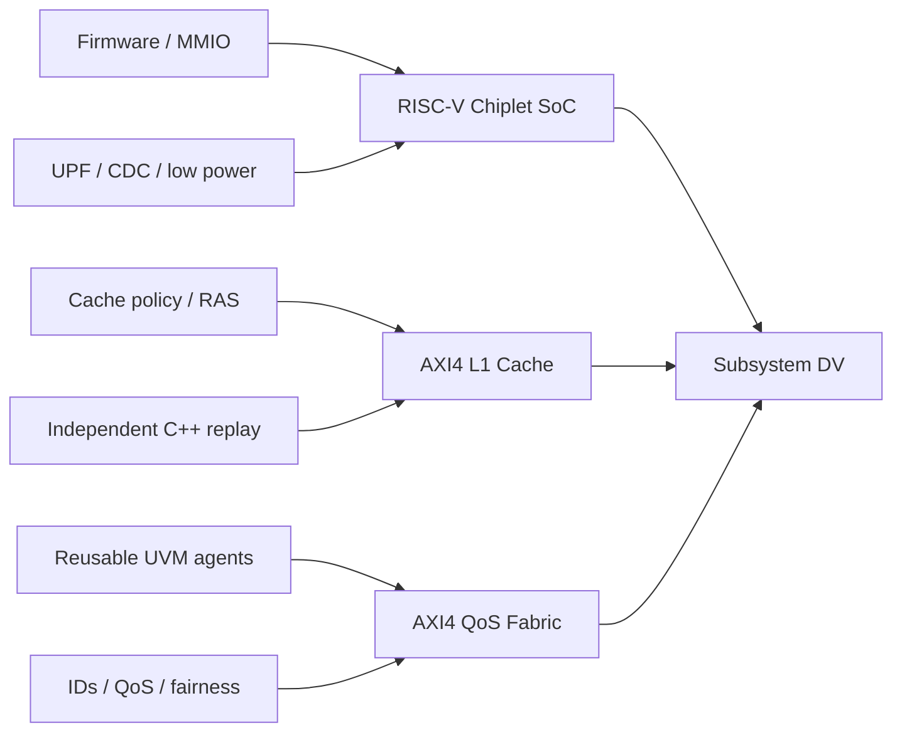

# SoC Design Verification Portfolio

I build report-backed RTL and verification projects with SystemVerilog, UVM,
Verilator, C/C++/SystemC reference models, assertions, formal checks, Python
automation, and open-source implementation tools. The three projects below are
deliberately separated by verification scope: firmware-driven subsystem
integration, cache microarchitecture/RAS, and reusable interconnect VIP.

| Project | Engineering focus | Measured evidence | Five-minute reviewer path |
| --- | --- | --- | --- |
| [RISC-V Chiplet SoC](https://github.com/ed766/ucie_chiplet_soc) | RV32/APB firmware control, queued DMA, parity-protected memory, behavioral UCIe-style transport, UPF 4.0, retention/isolation, async CDC, and LibreLane | `70/70` stable runs, `60/60` functional bins, `26/26` low-power targets, `12/12` firmware scenarios, `7/7` solver proofs | `make -C chiplet_extension project-check` and [project metrics](https://github.com/ed766/ucie_chiplet_soc/blob/main/docs/project_metrics.md) |
| [AXI4 L1 Cache DV](https://github.com/ed766/AXI4-L1-Cache-DV) | Blocking write-back cache, independent C++ trace replay, replacement/maintenance/error matrices, direct-mapped vs 2-way tradeoffs, and optional SECDED RAS | `22/22` directed tests, `100/100` stress rows, `55/55` interaction bins, `4/4` mutations, `7/7` SECDED RAS points | `make release-check` and [verification traceability](https://github.com/ed766/AXI4-L1-Cache-DV/blob/main/docs/traceability.md) |
| [AXI4 QoS Fabric DV](https://github.com/ed766/AXI4-QoS-Fabric-DV) | Four-master/four-target AXI4 subset, multiple outstanding IDs, legal out-of-order responses, QoS/aging fairness, real UVM, reusable AXI agent collateral, SystemC replay, and integrated CDC | `30/30` named tests, `100/100` random runs, `8/8` UVM tests, `56/56` bins, `24/24` advanced crosses, `6/6` mutations | `make project-check` and [reviewer guide](https://github.com/ed766/AXI4-QoS-Fabric-DV/blob/main/docs/reviewer_guide.md) |

## Portfolio Coverage

All published metrics are generated from checked-in CSV/Markdown reports.
These projects demonstrate open-source verification evidence, not UCIe/AXI
certification or commercial UPF, CDC, timing, and formal signoff.
