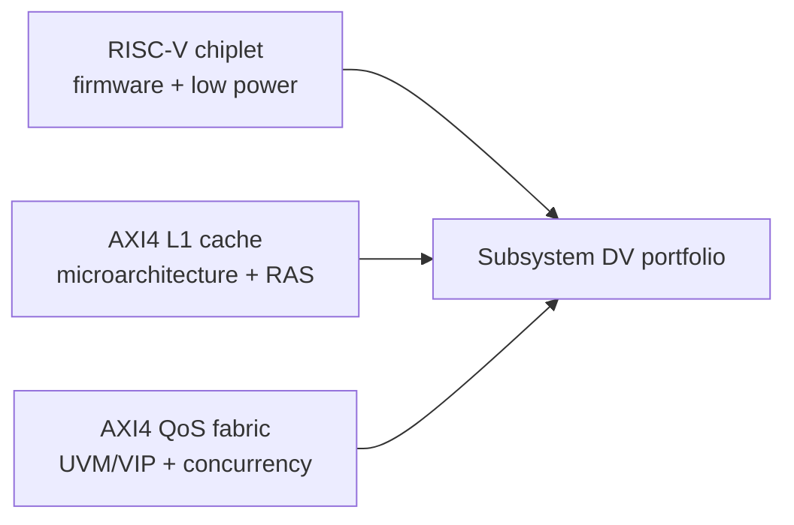

# SoC Design Verification Portfolio

I build report-backed RTL and verification projects with SystemVerilog, UVM, Verilator, C/C++/SystemC reference models, assertions, formal checks, Python automation, and open-source implementation tools. The portfolio is deliberately separated by verification scope rather than repeating the same claims across projects.

<!-- BEGIN GENERATED PORTFOLIO -->
| Project | Primary specialty | Selected measured evidence | Review |
| --- | --- | --- | --- |
| [RISC-V Chiplet SoC](https://github.com/ed766/ucie_chiplet_soc) | Firmware-driven subsystem integration, DMA, UPF, low power, CDC | `70 / 70` stable; `12 / 12` firmware; `26 / 26` power; `4 / 4` CDC | [Metrics](https://github.com/ed766/ucie_chiplet_soc/blob/main/docs/project_metrics.md) · [CI](https://github.com/ed766/ucie_chiplet_soc/actions) · [v1.1.1](https://github.com/ed766/ucie_chiplet_soc/releases/tag/v1.1.1) |
| [AXI4 L1 Cache DV](https://github.com/ed766/AXI4-L1-Cache-DV) | Cache microarchitecture, C++ replay, replacement/error checking, SECDED RAS | `22 / 22` directed; `127 / 127` replay; `55 / 55` crosses; `7 / 7` RAS | [Metrics](https://github.com/ed766/AXI4-L1-Cache-DV/blob/main/docs/project_metrics.md) · [CI](https://github.com/ed766/AXI4-L1-Cache-DV/actions) · [v0.3.2](https://github.com/ed766/AXI4-L1-Cache-DV/releases/tag/v0.3.2) |
| [AXI4 QoS Fabric DV](https://github.com/ed766/AXI4-QoS-Fabric-DV) | Reusable UVM/VIP, AXI concurrency, SystemC replay, QoS/fairness | `8 / 8` UVM; `130 / 130` replay; `24 / 24` advanced crosses; `72 / 72` QoS points | [Metrics](https://github.com/ed766/AXI4-QoS-Fabric-DV/blob/main/docs/project_metrics.md) · [CI](https://github.com/ed766/AXI4-QoS-Fabric-DV/actions) · [v0.3.1](https://github.com/ed766/AXI4-QoS-Fabric-DV/releases/tag/v0.3.1) |
<!-- END GENERATED PORTFOLIO -->

## Skills Matrix

| Area | Chiplet SoC | L1 cache | QoS fabric |
| --- | --- | --- | --- |
| System integration | RV32 firmware, APB MMIO, DMA, AES service | CPU/cache/AXI memory path | Four-initiator/four-target shared fabric |
| Verification methodology | Procedural closure plus supporting UVM/RAL | C++ trace replay and mutation-driven debug | Principal real-UVM lane and reusable AXI agents |
| Architecture depth | UPF, retention/isolation, async CDC | Replacement, maintenance, associativity, SECDED | IDs, out-of-order responses, QoS, aging, fairness |
| Independent models | Python/C transaction and CRC models | Cycle-independent C++ cache model | SystemC/TLM arbitration and routing model |
| Evidence | Firmware, power, formal, CDC, coverage | Stress, crosses, RAS, performance, synthesis proxy | UVM, VIP self-test, QoS dashboard, CDC, formal |

All headline metrics are generated from checked-in canonical reports. These projects demonstrate open-source engineering evidence, not UCIe/AXI certification or commercial UPF, CDC, timing, and formal signoff.
